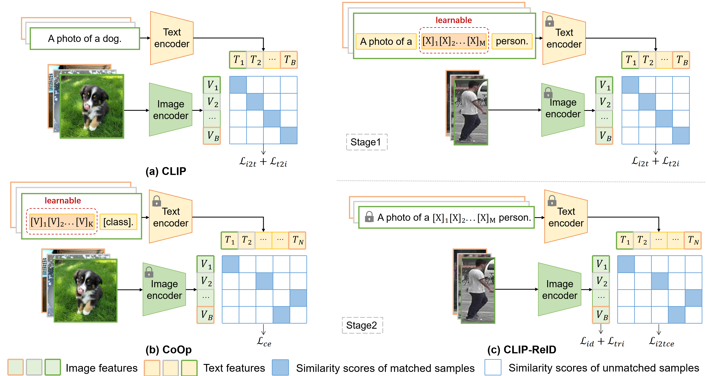

# Meta-Feature Adapter: Integrating Environmental Metadata for Enhanced Animal Re-identification

## Abstract
Identifying individual animals within large wildlife populations is essential for effective wildlife monitoring and conservation efforts. Recent advancements in computer vision have shown promise in animal re-identification (Animal ReID) by leveraging data from camera traps. However, existing methods rely exclusively on visual data, neglecting environmental metadata that ecologists have identified as highly correlated with animal behavior and identity, such as temperature and circadian rhythms. To bridge this gap, we propose the Meta-Feature Adapter (MFA), a lightweight module designed to integrate environmental metadata into vision-language foundation models, such as CLIP, to enhance Animal ReID performance. Our approach translates environmental metadata into natural language descriptions, encodes them into metadata-aware text embeddings, and incorporates these embeddings into image features through a cross-attention mechanism. Furthermore, we introduce a Gated Cross-Attention mechanism that dynamically adjusts the weights of metadata contributions, further improving performance. To validate our approach, we constructed the Metadata Augmented Animal Re-identification (MAAR) dataset, encompassing six species from New Zealand and featuring paired image data and environmental metadata. Extensive experiments demonstrate that MFA consistently improves Animal ReID performance across multiple baseline models.

### Architecture
<!--  -->

### Installation
```
conda create -n 'your-env-name' python=3.8
conda activate 'your-env-name'
conda install pytorch==1.8.0 torchvision==0.9.0 torchaudio==0.8.0 cudatoolkit=10.2 -c pytorch
pip install yacs
pip install timm
pip install scikit-image
pip install tqdm
pip install ftfy
pip install regex
```

### Training
```
python train_mfareid.py --config_file configs/animal/vit_mfareid.yml
```

### Data Availability
The full MAAR dataset will be made publicly available upon the acceptance of our paper. This includes:
- Complete image sets for all six species
- JSON files containing environmental metadata for each image
- Standard data splits for reproducible evaluation

<!-- For inquiries about early access to the dataset for research purposes, please contact [contact information]. -->